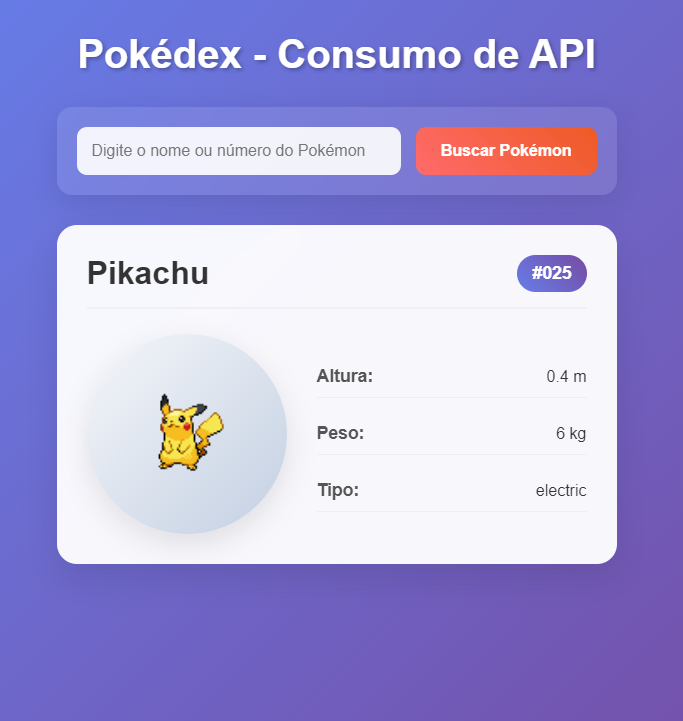

# 📘 Pokédex - Consumo de API com JavaScript

Este projeto é uma Pokédex interativa desenvolvida para a Lista 03 da disciplina de **Programação para Internet (PI-CC)**. Utiliza a [PokéAPI](https://pokeapi.co/) para buscar informações detalhadas sobre qualquer Pokémon baseado em seu nome ou número.

[🔗 Repositório no GitHub](https://github.com/Marcondes05/PI-CC-Lista03)

---

## 📸 Demonstração



---

## 🚀 Tecnologias Utilizadas

- HTML5
- CSS3 (com responsividade e animações)
- JavaScript (ES6)
- PokéAPI (https://pokeapi.co/)

---

## 📦 Estrutura do Projeto

```
PI-CC-Lista03/
├── index.html       # Estrutura HTML da aplicação
├── style.css        # Estilo visual com responsividade e animações
└── script.js        # Lógica JS para consumo da API e manipulação da interface
```

---

## 💡 Funcionalidades

- 🔎 Busca por nome ou número do Pokémon.
- 📄 Exibição de:
  - Nome
  - Número (ID)
  - Sprite (imagem)
  - Altura e peso
  - Tipos
- ⚠️ Exibição de mensagens de erro e carregamento.
- 📱 Layout responsivo.

---

## ▶️ Como Usar

1. Clone este repositório:
   ```bash
   git clone https://github.com/Marcondes05/PI-CC-Lista03.git
   ```
2. Navegue até a pasta do projeto:
   ```bash
   cd PI-CC-Lista03
   ```
3. Abra o arquivo `index.html` em um navegador moderno.

---

Este projeto é de uso livre para fins educacionais. Desenvolvido para fins acadêmicos.

---


